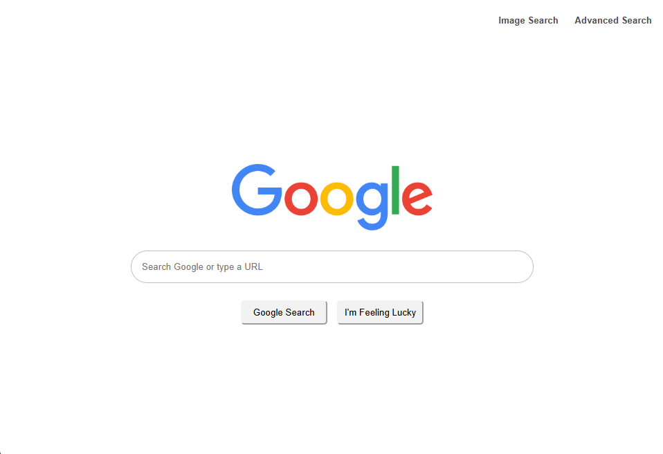
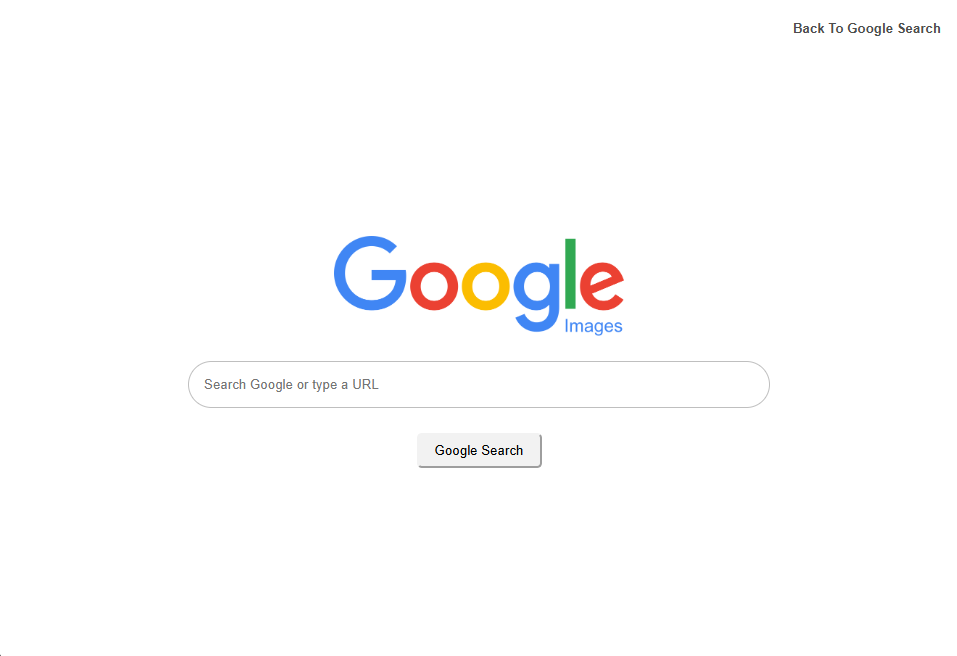
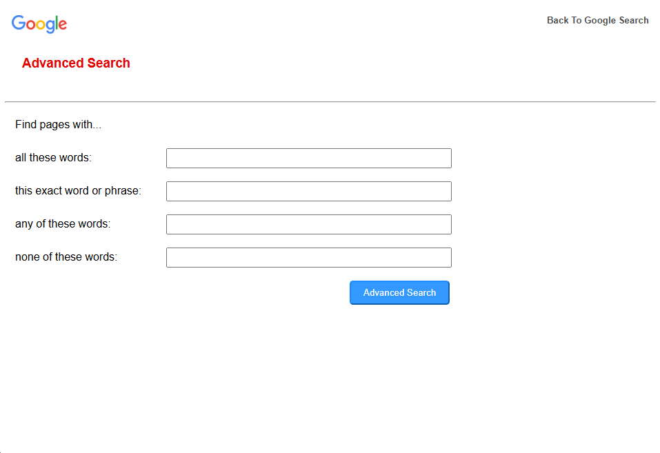

# 🔍 Google-Style Search Interface Clone

This project is a front-end web application that replicates the core layout and functionality of Google's search pages, including **regular search**, **image search**, and **advanced search**. Built using **HTML and CSS**, it delivers a clean, user-friendly interface that closely mirrors Google's design and behavior.

---

## 🌐 Live Pages

* `index.html` – Main search page (standard Google Search)
* `image-search.html` – Image search interface
* `advanced-search.html` – Advanced search page with multiple filtering options

---

## 🚀 Features

### 💻 Main Search Page (`index.html`)

<p align="center">
  
</p>

* Centered search bar with rounded corners, styled to match Google's aesthetic
* Two buttons:

  * **Google Search** – Opens the search results for the entered query
  * **I’m Feeling Lucky** – Redirects directly to the **first result** for the query
* Navigation links in the top-right corner:

  * Image Search
  * Advanced Search

---

### 🖼️ Image Search Page (`image-search.html`)

<p align="center">
  
</p>

* Layout and style consistent with the main search page
* Redirects users to Google Image search results for their query
* Includes a link in the top-right to return to the main search page

---

### 🛠️ Advanced Search Page (`advanced-search.html`)

<p align="center">
  
</p>

* Includes four vertically stacked input fields:

  * **All these words**
  * **This exact word or phrase**
  * **Any of these words**
  * **None of these words**
* Fields are **left-aligned** to match Google's layout
* Styled **blue "Advanced Search" button** with white text
* Clicking the button takes users to the appropriate Google Advanced Search results

---

## 🎨 Design & Aesthetics

* Clean, minimalist design based on Google’s current styling
* Responsive layout and consistent spacing
* Custom CSS replicates Google’s visual theme

---

## 📁 File Structure

```
/Code
├── index.html              # Main Google Search clone
├── image-search.html       # Google Image Search clone
├── advanced-search.html    # Google Advanced Search clone
├── styles.css              # Shared styling across all pages
└── /images
    ├── google-logo.png         # Logo for main search page
    ├── google-images.png       # Logo for image search
    └── google-advanced.png     # Image for advanced search (optional)
```
---

## ▶️ How to Run

1. Clone or download the repository.
2. Open `index.html` in your browser.
3. Use the navigation links to move between pages.

---

## 📌 Notes

* All searches are handled via redirects to **live Google search services**.
* No JavaScript or backend is used — this is a **purely static front-end project**.

---
